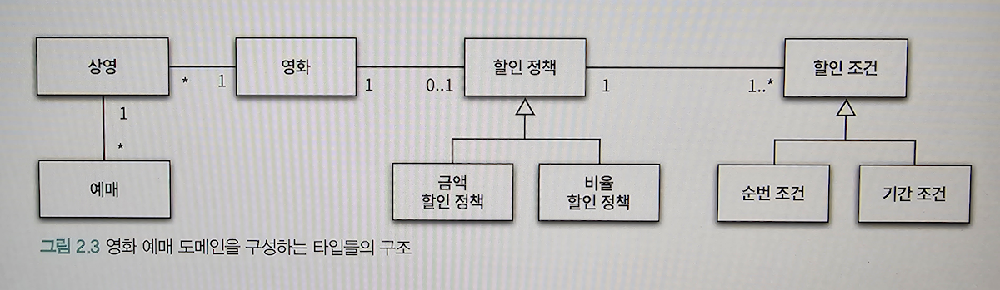
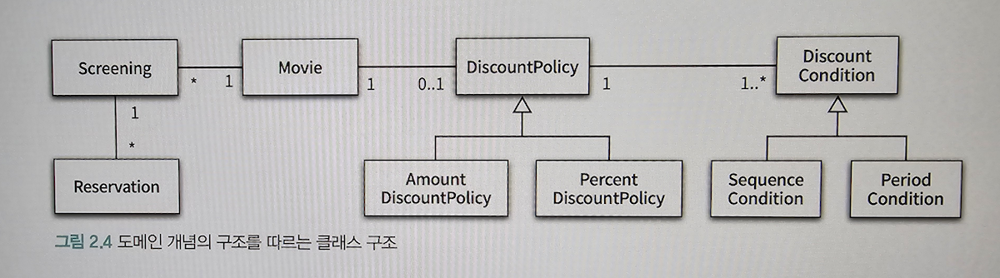
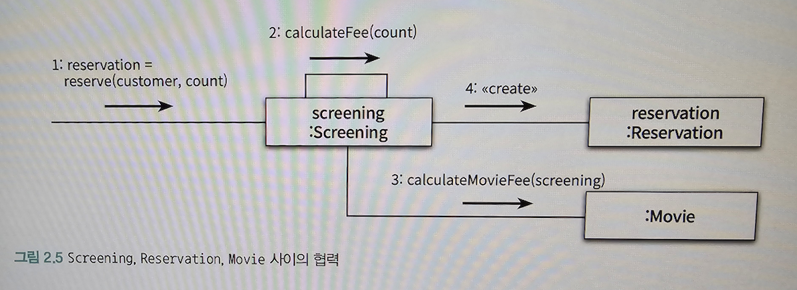
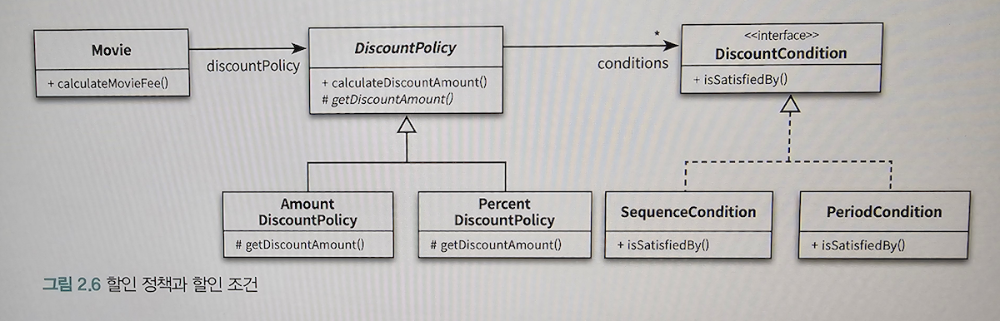
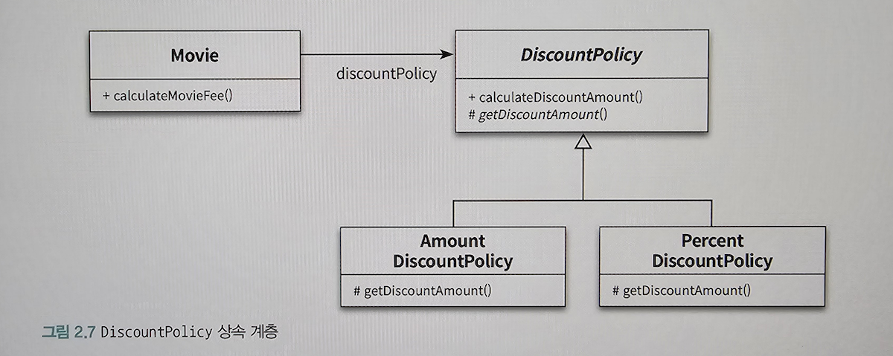

# 객체지향 프로그래밍

## 01. 영화 예매 시스템

### 요구사항 살펴보기

- 영화: 영화에 대한 기본정보
- 상영: 관객들이 영화를 관람하는 사건
- 영화 예매 X -> 특정 시간에 상영되는 영화를 관람할 수 있는 권리 구매
- 할인: 특정 조건을 만족하는 예매자는 요금 할인을 받을 수 있다.
- 할인 조건: 가격의 할인 여부를 결정
    - 순서 조건: 상영 순번을 이용해 할인 여부를 결정하는 규칙
    - 기간 조건: 영화 상영 시작 시간을 이용해 할인 여부를 결정
- 할인 정책: 할인 요금을 결정
    - 금액 할인 정책: 예매 요금에서 일정 금액을 할인해주는 방식
    - 비율 할인 정책: 정가에서 일정 비율의 요금을 할인해 주는 방식
- 영화별로 0 이나 1개의 할인 정책을 지정 가능
- 영화별로 다수의 할인 조건을 지정 가능 -> 순서, 기간 조건을 섞는 것도 가능
- 할인 적용: 할인 조건과 할인 정책을 조합해서 사용
    - 할인 조건을 만족할 경우 할인 정책을 이용해 할인 요금을 계산
    - 할인 정책은 적용돼 있지만 할인 조건을 만족하지 못하는 경우나 할인 정책이 적용돼 있지 않은 경우에는 요금을 할인하지 않는다.

## 02. 객체지향 프로그래밍을 향해

### 협력, 객체, 클래스

- 객체지향: 클래스가 아닌 객체에 초점을 맞춘다.

1. 어떤 클래스가 필요한지를 고민하기 전에 어떤 객체들이 필요한지 고민 한다.
2. 객체를 독립적인 존재가 아니라 기능을 구현하기 위해 협력하는 공동체의 일원으로 봐야 한다.

### 도메인의 구조를 따르는 프로그램 구조

- 영화는 여러번 상영될 수 있고 상영은 여러 번 예매될 수 있다.
- 영화에는 할인 정책을 할당하지 않거나 할당하더라도 오직 하나만 할당할 수 있고 할인 정책이 존재하는 경우에는 하나 이상의 할인 조건이 반드시 존재한다.
- 클래스의 이름은 대응되는 도메인 개념의 이름과 동일하거나 유사하게 지어야 한다.
- 클래스 사이의 관계도 도메인 개념 사이에 맺어진 관계와 유사하게 만들어서 프로그램 구조를 이해하고 예상하기 쉽게 만들어야 한다.

### 클래스 구현하기

- 경계의 명확성: 외부에서는 객체의 속성에 접근할 수 없도록 막고 적절한 메서드를 통해 내부상태를 변경할 수 있게 해야한다.
    - 객체의 자율성을 보장
    - 프로그래머에게 구현의 자유를 제공

#### 자율적인 객체

1. 객체가 상태(stage) 와 행동(behavior) 을 함께 가지는 복합적인 존재
2. 객체가 스스로 판단하고 행동하는 자율적인 존재

- 캡슐화: 데이터와 기능을 묶어서 문제 영역의 아이디어를 적절하게 표현
- 접근 제어: 외부에서의 접근을 통제 -> 객체를 자율적인 존재로 만들기 위함
- 인터페이스와 구현의 분리(separation of interface and implementation)
    - 퍼블릭 인터페이스(public interface): 외부에서 접근 가능한 부분
    - 구현(implementation): 내부에서만 접근 가능한 부분

#### 프로그래머의 자유

- 프로그래머의 역할 구분
    - 클래스 작성자(class creator)
    - 클라이언트 프로그래머(client programmer)
- 구현 은닉(implementation hiding)
    - 클래스 작성자는 클라이언트 프로그래머에게 필요한 부분만 공개하고 나머지는 숨긴다.
    - 클라이언트 프로그래머가 숨겨놓은 부분에 접근할 수 없도록 방지하고 내부 구현을 마음대로 변경할 수 있다.

### 협력하는 객체들의 공동체

- 의미를 좀 더 명시적이고 분명하게 표현할 수 있다면 객체를 사용해 해당 개념을 구현한다.
- 그 개념이 하나의 인스턴스 변수만 포함하더라도 개념을 명시적으로 표현하는 것은 전체적인 설계의 명확성과 유연성을 높인다.
- 협력(collaboration): 어떤 기능을 구현하기 위해 객체들 사이에 이뤄지는 상호작용

### 협력에 관한 짧은 이야기

- 메서드(method): 메세지를 수신한 객체가 수신된 메세지를 처리하기 위한 방법

## 03. 할인 요금 구하기

### 할인 요금 계산을 위한 협력 시작하기

- Movie 는 calculateMovieFee 메서드에서 discountPolicy 에 calculateDiscountAmount 메세지를 전송한다
- 할인 정책을 판단하는 코드는 존재하지 않는다.
- 두가지 개념이 숨어있는데 하나는 상속(inheritance) 이고 다른 하나는 다형성(polymorphism) 이다.

### 할인 정책과 할인 조건

- 할인 정책
    - 금액 할인 정책과 비율 할인 정책으로 구분된다.
    - 각 정책의 대부분의 코드가 유사하고 요금을 계산하는 방식만 조금 다르다.
    - 두 클래스 사이의 중복 코드는 추상 클래스(abstract class)인 DiscountPolicy 에 구현한다.
    - DiscountPolicy 는 할인 여부와 요금 계산에 필요한 전체적인 흐름은 정의하지만 실제로 요금을 계산하는 부분은 추상메서드인 getDiscountAmount 메서드에 위임한다.
    - 실제로는 DiscountPolicy 를 상속받은 자식 클래스에서 오버라이딩한 메서드가 실행된다.
    - 부모 클래스에서 기본적인 알고리즘의 흐름을 구현하고 중간에 필요한 처리를 자식 클래스에게 위임하는 디자인 패턴을 Template Method 패턴이라 부른다.
- 할인 조건
    - 순번 조건과 기간 조건이 존재한다.
    - 할인 조건은 DiscountCondition 인터페이스를 상속한다.

- 오버라이딩과 오버로딩
- 오버라이딩: 부모 클래스에 정의된 같은 이름, 같은 파라미터 목록을 가진 메서드를 자식 클래스에서 재정의하는 경우
- 오버로딩: 메서드 이름을 같지만 제공되는 파라미터의 목록이 다르다.

### 할인 정책 구성하기

- Movie 의 생성자는 DiscountPolicy 하나만 받을 수 있도록 선언됨
- DiscountPolicy 생성자는 여러개의 DiscountCondition 인스턴스를 허용함
- 생성자를 통해 초기화에 필요한 정보를 전달하도록 강제하면 올바른 상태를 가진 객체의 생성을 보장할 수 있다.

## 04. 상속과 다형성

- Movie 클래스는 할인 정책에 대해 판단하지 않는다.

### 컴파일 시간 의존성과 실행 시간 의존성

